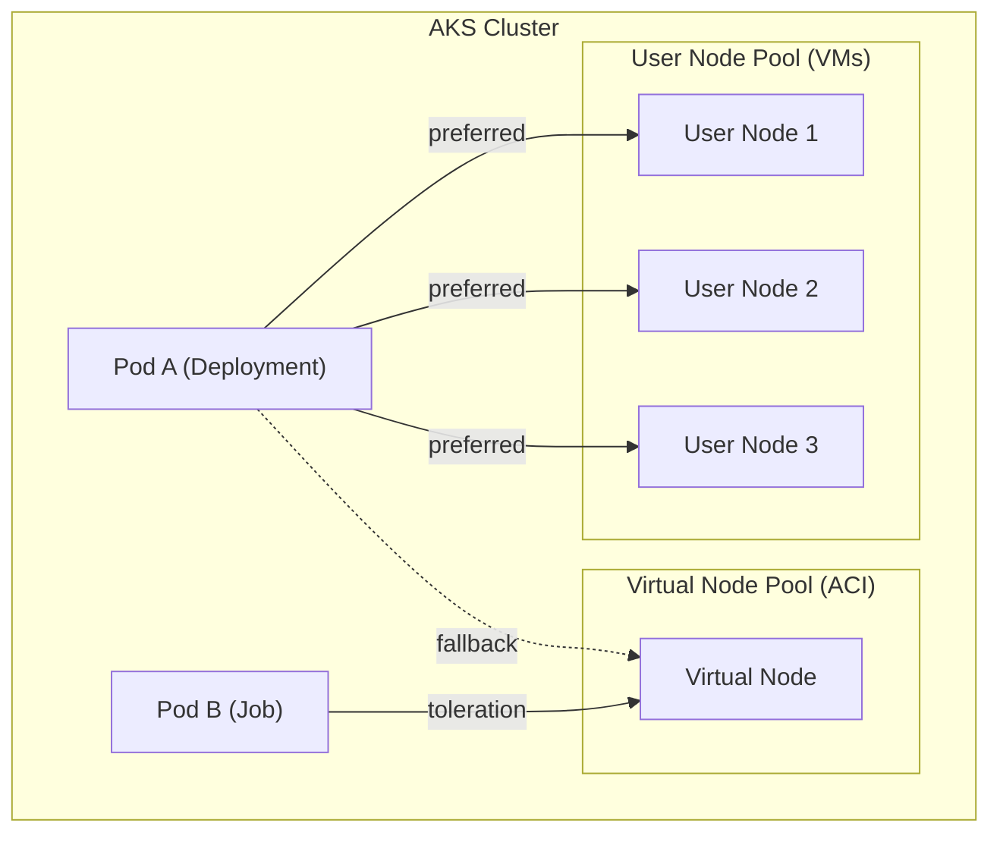

import Admonition from '@theme/Admonition';

In vielen Projekten ist das **Kosten- und Ressourcenmodell** entscheidend:  
- Physische AKS-Node-Pools (`user nodes`) sind günstiger und für Dauer-Workloads optimiert.  
- **Virtual Nodes** (auf Basis von Azure Container Instances) eignen sich ideal für **Burst-Szenarien** – wenn kurzfristig mehr Kapazität benötigt wird.  
<!--truncate-->
👉 Ziel: Workloads sollen **immer zuerst** die physischen Nodes nutzen, aber automatisch auf Virtual Nodes ausweichen, wenn dort keine Ressourcen mehr frei sind.

---

## ⚙️ Grundlagen: Node Pools in AKS
- **System Pool**: interne AKS-Services  
- **User Pool**: physische VM-basierten Nodes (z. B. VMSS mit Standard_D4s_v5)  
- **Virtual Node Pool**: basiert auf ACI, hochskalierbar, Pay-per-Use, keine VM-Instanzkosten  

---

## 🚧 Herausforderung
Kubernetes verteilt Pods standardmäßig gleichmäßig – ohne „Bevorzugung“.  
Wenn man Virtual Nodes **nur als Notnagel** einsetzen will, braucht es eine saubere Scheduling-Strategie.

---

## ✅ Strategien für Node Selection

### 1. NodeSelector + Taints/Tolerations
- User Nodes: keine speziellen Taints → Pods laufen standardmäßig hier.  
- Virtual Nodes: mit Taint versehen (`virtual-kubelet.io/provider=azure:NoSchedule`).  
- Nur Pods, die **tolerations** setzen, dürfen auf Virtual Nodes ausweichen.

```yaml
tolerations:
  - key: "virtual-kubelet.io/provider"
    operator: "Equal"
    value: "azure"
    effect: "NoSchedule"
````

➡️ Vorteil: volle Kontrolle, Default = User Nodes, Virtual Nodes = Fallback.

---

### 2. Affinity & Preferred Scheduling

Mit `nodeAffinity` lässt sich eine **Präferenz** ausdrücken:

* „Bevorzuge User Nodes“ (preferred)
* „Erlaube Virtual Nodes“ (soft)

```yaml
affinity:
  nodeAffinity:
    preferredDuringSchedulingIgnoredDuringExecution:
      - weight: 100
        preference:
          matchExpressions:
            - key: kubernetes.azure.com/mode
              operator: In
              values:
                - user
```

👉 Erst wenn dort kein Platz mehr ist, werden Pods auch auf andere Nodes (inkl. Virtual Node) verteilt.

---

### 3. Workload-Spezifische Steuerung

* **Batch-/Burst-Jobs**: `tolerations` setzen, damit sie Virtual Nodes nutzen dürfen.
* **Dauerhafte Services**: kein Taint/Toleration → bleiben strikt auf physischen Nodes.

---

## 📊 Visualisierung: Scheduling-Strategie



* **Pod A (Deployment)**: bevorzugt User Nodes, fällt aber bei Ressourcenknappheit auf Virtual Nodes zurück.
* **Pod B (Job)**: hat explizite Toleration → darf direkt auf Virtual Nodes laufen.

---

## 📌 Best Practices

* **Monitoring**: genau tracken, wie viele Pods auf Virtual Nodes laufen (Kostenkontrolle).
* **SLA**: Virtual Nodes haben andere Limits (kein DaemonSet-Support, eingeschränkte Features).
* **Workload-Design**: kurze Jobs und burstartige Lasten → Virtual Nodes; kritische Systeme → User Nodes.
* **Kostenmodell**: Physische Pools für Grundlast, Virtual Nodes nur für Spitzen.

<Admonition type="tip" title="Kostenfalle vermeiden">
Setzt Limits und Autoscaling sauber, sonst landen zu viele Pods dauerhaft auf teuren Virtual Nodes!
</Admonition>

---

## 📌 Fazit

Mit **Affinity, Taints & Tolerations** lässt sich ein zweistufiges Scheduling umsetzen:

* Dauerhafte Workloads laufen zuverlässig und kosteneffizient auf physischen User Nodes.
* Lastspitzen landen automatisch auf Virtual Nodes – flexibel, skalierbar und ohne Overprovisioning.

---

## 📦 Beispiel‑Manifeste (Deployment & BatchJob)

> Annahmen:
>
> * **User Nodes** tragen das Label: `kubernetes.azure.com/mode=user`
> * **Virtual Nodes** sind mit `virtual-kubelet.io/provider=azure:NoSchedule` getaintet
> * Cluster hat mindestens einen Linux Virtual Node (ACI)

### 1) Deployment: bevorzugt User Nodes, Fallback auf Virtual Node

```yaml
apiVersion: apps/v1
kind: Deployment
metadata:
  name: web-frontend
  labels:
    app: web-frontend
spec:
  replicas: 3
  selector:
    matchLabels:
      app: web-frontend
  template:
    metadata:
      labels:
        app: web-frontend
    spec:
      # ❶ Bevorzuge physische User-Nodes
      affinity:
        nodeAffinity:
          preferredDuringSchedulingIgnoredDuringExecution:
            - weight: 100
              preference:
                matchExpressions:
                  - key: kubernetes.azure.com/mode
                    operator: In
                    values: ["user"]
      # ❷ Erlaube Fallback auf Virtual Nodes (Taint tolerieren)
      tolerations:
        - key: "virtual-kubelet.io/provider"
          operator: "Equal"
          value: "azure"
          effect: "NoSchedule"
      # ❸ Optional: Verteile Pods über User-Nodes (Kosten & Resilienz)
      topologySpreadConstraints:
        - maxSkew: 1
          topologyKey: kubernetes.io/hostname
          whenUnsatisfiable: ScheduleAnyway
          labelSelector:
            matchLabels:
              app: web-frontend
      containers:
        - name: app
          image: ghcr.io/example/web:1.2.3
          ports:
            - containerPort: 8080
          resources:
            requests:
              cpu: "250m"
              memory: "256Mi"
            limits:
              cpu: "1"
              memory: "512Mi"
```

> Ergebnis: Solange auf User-Nodes Ressourcen frei sind, werden dort alle Replikas platziert. Erst bei Knappheit dürfen Pods dank **Toleration** auch auf Virtual Nodes geplant werden.

---

### 2) BatchJob: bevorzugt Virtual Node, um User-Pool zu schonen

```yaml
apiVersion: batch/v1
kind: Job
metadata:
  name: image-transcode
spec:
  completions: 5
  parallelism: 5
  backoffLimit: 0
  template:
    spec:
      # ❶ Bevorzuge Virtual Node (weich), erlaube aber User als Backup
      affinity:
        nodeAffinity:
          preferredDuringSchedulingIgnoredDuringExecution:
            - weight: 100
              preference:
                matchExpressions:
                  - key: kubernetes.io/role
                    operator: In
                    values: ["virtual-node"]
      # ❷ Toleration für den Virtual-Node-Taint (nötig zum Scheduling)
      tolerations:
        - key: "virtual-kubelet.io/provider"
          operator: "Equal"
          value: "azure"
          effect: "NoSchedule"
      restartPolicy: Never
      containers:
        - name: worker
          image: ghcr.io/example/transcoder:2.0.0
          args: ["--input", "$(INPUT)", "--output", "$(OUTPUT)"]
          env:
            - name: INPUT
              value: "/data/in"
            - name: OUTPUT
              value: "/data/out"
          resources:
            requests:
              cpu: "1"
              memory: "1Gi"
            limits:
              cpu: "2"
              memory: "2Gi"
```

> Hinweis: Der Key `kubernetes.io/role=virtual-node` ist **ein Beispiel-Label**. In vielen Clustern existiert bereits ein passendes Label auf Virtual Nodes (z. B. `type=virtual-kubelet` oder `kubernetes.azure.com/virtual-node=true`). Passe den **Match-Expression** an eure tatsächlichen Node-Labels an.

---

### 3) Variante: Striktes Trennen per NodeSelector

Wenn bestimmte Workloads **nie** auf Virtual Nodes laufen sollen, nutze einen harten `nodeSelector` auf User-Nodes **ohne** Toleration:

```yaml
spec:
  template:
    spec:
      nodeSelector:
        kubernetes.azure.com/mode: "user"
      # Keine Toleration → kein Scheduling auf Virtual Nodes möglich
```

Und umgekehrt (nur Virtual Node):

```yaml
spec:
  template:
    spec:
      tolerations:
        - key: "virtual-kubelet.io/provider"
          operator: "Equal"
          value: "azure"
          effect: "NoSchedule"
      nodeSelector:
        kubernetes.azure.com/virtual-node: "true" # Beispiel-Label, bei euch anpassen
```

---

### 4) Horizontal Pod Autoscaler (HPA) als Burst-Trigger

```yaml
apiVersion: autoscaling/v2
kind: HorizontalPodAutoscaler
metadata:
  name: web-frontend
spec:
  scaleTargetRef:
    apiVersion: apps/v1
    kind: Deployment
    name: web-frontend
  minReplicas: 3
  maxReplicas: 30
  metrics:
    - type: Resource
      resource:
        name: cpu
        target:
          type: Utilization
          averageUtilization: 70
```